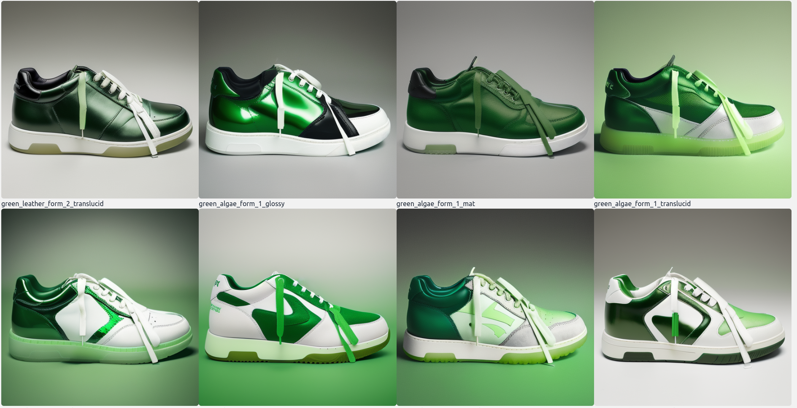
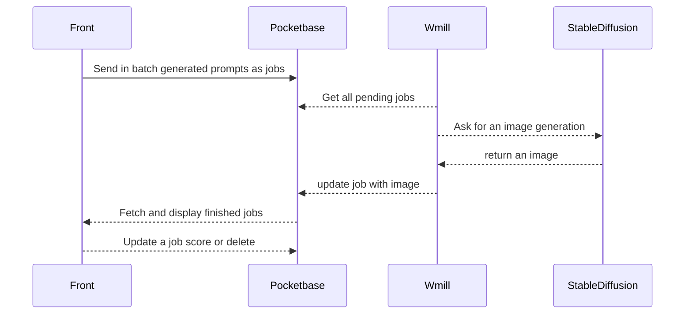
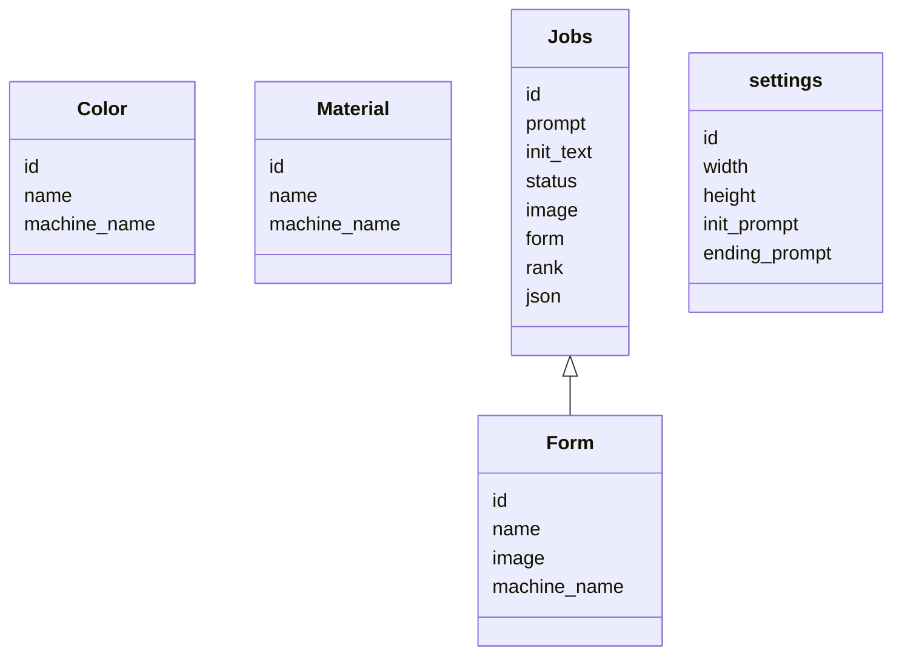

# sneaker_tycoon_shoe_maker
A batch stable diffusion generator

For the purpose of this project, there was a need to generate a large number of 
shoe combinations. This project is a batch generator that generates a large number of shoe combinations and stores them in a database.

## Architecture 

The project is made up of 4 parts
- Frontend (svelte/typescript)
- Pocketbase (job database)
- Windmill (job scheduler)
- Stable Diffusion (image generator)

Database schema

## Usage

**Needs to access the automatic111 stable diffusion api   [setup instruction](https://github.com/AbdBarho/stable-diffusion-webui-docker/wiki/Setup)**

**Env**
Copy the .env.example file to .env and fill in the values

**Run**
` docker compose up `

